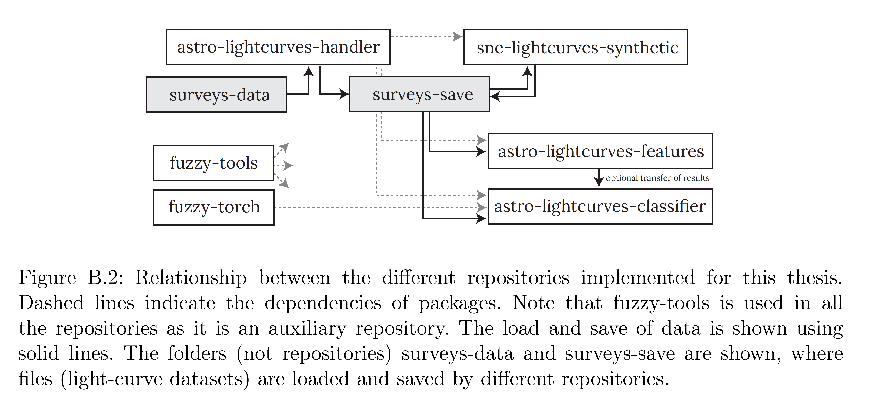

 
# Astro Light-Curves Classifier ✨🤖

(This code is still in preparation!)

- **fuzzy-tools**: used as an auxiliary repository for multiple and diverse purposes, such as file handling (Pickle-based); plot visualizations (Matplotlib-based); string, list, dictionary, and other data-structures handling; different data science methods; among many others. Url: https://github.com/oscarpimentel/fuzzy-tools.

- **fuzzy-torch**: used as an auxiliary repository for training Pytorch based models. It also contains several basic models, functions, methods, and routines used for the implementation of other Deep Learning models, such as the ones shown in this \docname. Url: https://github.com/oscarpimentel/fuzzy-torch.

- **astro-lightcurves-handler**: used as an auxiliary repository for the creation and handling of multi-band light-curves objects and light-curve datasets. It is also used to apply the pre-processing methods over the light-curve datasets, e.g., sigma clipping, train/val/test split. Url: https://github.com/oscarpimentel/astro-lightcurves-handler.

- **sne-lightcurves-synthetic**: used for the generation of synthetic SN multi-band light-curves and datasets. Url: https://github.com/oscarpimentel/sne-lightcurves-synthetic.

- **astro-lightcurves-features**: used for the extraction of features from the multi-band light-curves. It is also used for the training of the BRF baseline. Url: https://github.com/oscarpimentel/astro-lightcurves-features.

- **astro-lightcurves-classifier**: used for the implementation and training of all the tested Deep Learning models. Url: https://github.com/oscarpimentel/astro-lightcurves-classifier.

---

- models [lcclassifier/models/model_baselines.py](lcclassifier/models/model_baselines.py)
- TimeModAttn encoders [lcclassifier/models/attn/encoders.py](lcclassifier/models/attn/encoders.py)
- decoders: [lcclassifier/models/rnn/decoders.py](lcclassifier/models/rnn/decoders.py)
- classifier: [lcclassifier/models/classifiers.py](lcclassifier/models/classifiers.py)

(in [fuzzy-torch](https://github.com/oscarpimentel/fuzzy-torch))
- TimeModAttn [fuzzytorch/models/attn/basics.py](https://github.com/oscarpimentel/fuzzy-torch/blob/master/fuzzytorch/models/attn/basics.py)
- TimeFiLM [fuzzytorch/models/others.py](https://github.com/oscarpimentel/fuzzy-torch/blob/master/fuzzytorch/models/others.py)

---
## Data

surveys-data: https://drive.google.com/drive/folders/1pkDu-iF_vJTWrGxVmeJJls7Z8Q1jd3ek?usp=sharing

surveys-save: https://drive.google.com/drive/folders/1g_9ZRypfL8__ml3vYx2gxCpZWzf3iORd?usp=sharing

Public data for this project: https://drive.google.com/drive/folders/1jyc0NwG0SLnrtf322eTv3s02ezeZEXyS?usp=sharing

`save/`

---
## References
Feel free to see the thesis associated with this work here: ???